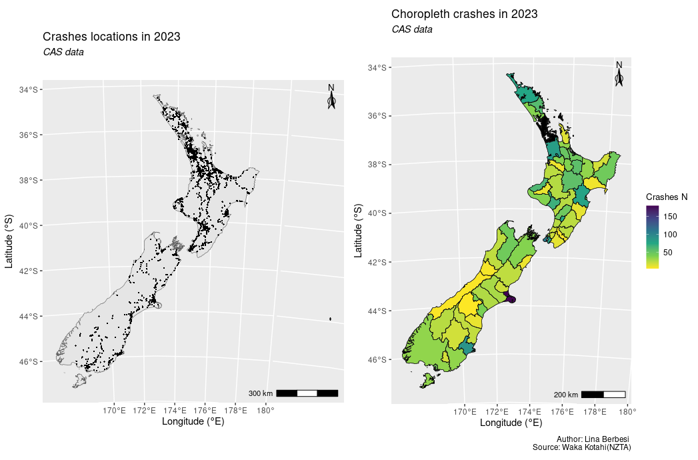
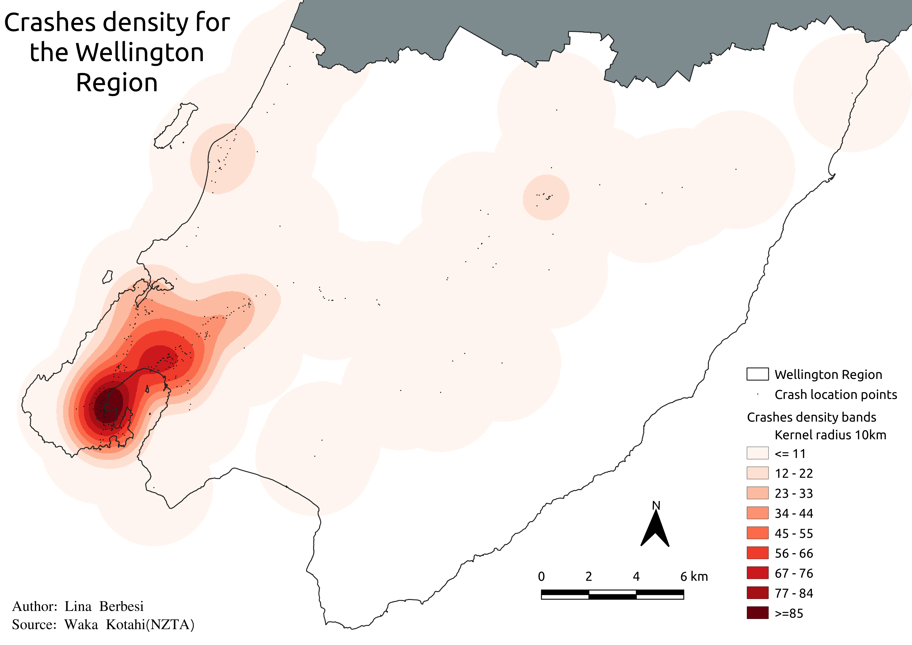
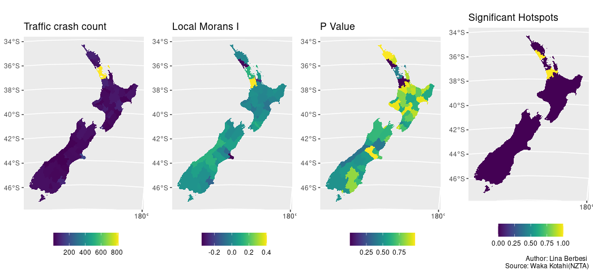
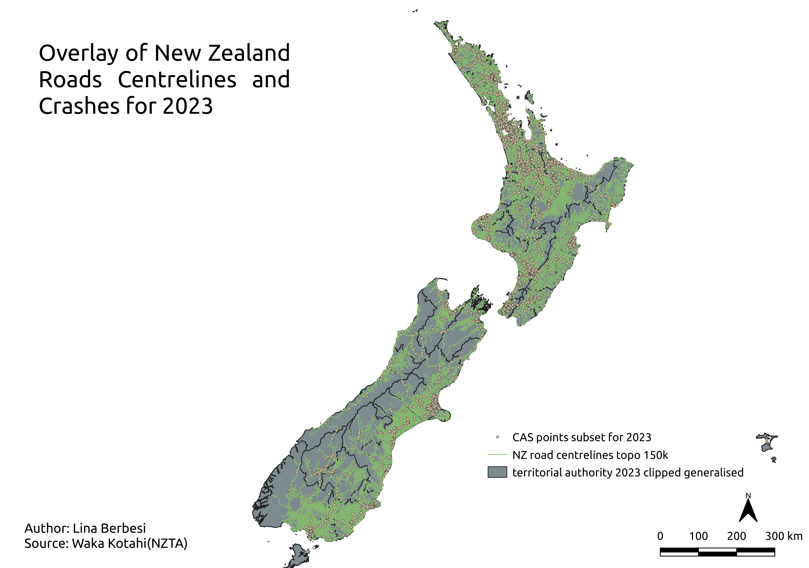

```{r setup, include=FALSE}
knitr::opts_chunk$set(echo=TRUE,width=30)
```


```{r, include=FALSE}
suppressPackageStartupMessages(library(dplyr,warn.conflicts = FALSE))
```

```{r out.width="400px",echo=FALSE}
url <- "lWEYy30YgWI-unsplash.jpg"
knitr::include_graphics(url)

```

<style>
p.caption {
  font-size: 0.6em;
}
</style>


<p class="caption">  Unsplash images Taken from: https://unsplash.com/photos/ </p>

---

# Situation

Insights on crashes can assist in a better understanding of the effect of various factors on crashes, leading to developing effective countermeasures. <sup> 1 </sup>

For government purposes crashes represent both social and financial costs in terms of people injured, life lost and claims logged through ACC. 

For research purposes crashes represent an interesting opportunity where a variety of quantitative methods could be used. From classification models based on the type of crash or crash severity, to regression models and density analysis based on the number of crashes.

.footnote[[1] Sage https://journals.sagepub.com/doi/10.1177/03611981211037882]

---

# Action/ Results

Accidents data was obtained from CAS  <sup> 1 </sup>

Spatial analysis and modelling started by doing a point-in-polygon allocation from the crash geo-locations to spatial units, in this case both the territorial authorities and regional council administrative boundaries. 

Point pattern analysis and density analysis for accidents that occurred in 2023 were carried out to identify how do they behave related to the degree of spatial aggregation.

Lastly a poisson bayesian regression was applied on the last five years to unveil  the effect of road/network variables in the number of crashes.


.footnote[[1] NZTA https://opendata-nzta.opendata.arcgis.com/]
---

# Insights
Urban centers, Auckland and Wellington City, register the higher number of crashes in the North Island. Followed by rural districts like Far North and Hastings. While in the South Island crashes seem to be clustered in the Canterbury and Otago regions, more specifically around Christchurch and Dunedin.

```{r crashespoints, echo=FALSE, message=FALSE,out.width="80%"}

```
---
```{r density, echo=FALSE, message=FALSE,out.width="80%"}

```

When using kernel density estimation (hot spot analysis) over the Wellington region , it can be seen that there are a high clusters of traffic accidents in the Wellington City and Lower/Upper Hutt Districts. This is particularly true for the suburbs of Thordon, Pipitea, Wellington central, Te Aro, Oriental Bay and Mount Victoria where crashes are registered in rates of seventy-seven or over. Clusters with medium to low rates are registered in Masterton and Kāpiti.
---

To measure the spatial autocorrelation Moran's I was calculated. In addition to Moran's I, p-values and significant hotspots where p-values were less than 0.05 to be considered statistically significant were calculated.  Significant hotspots show areas where the null hypothesis from Moran's  I, attributes distribute randomly, should be rejected.

```{r moransi, echo=FALSE, message=FALSE}

```

---

# Model
For the model additional network variables such as the count of roads by polygon were included. Lower geography aggregation, meshblocks, although desirable is hard to accomplish in terms of information publicly available.   
```{r roadstopo, echo=FALSE, alignment="left",message=FALSE,out.width="80%"}

```

---

For the model fitting instead of using a poisson linear regression where only single values are obtained for the model parameters of the traffic accidents. Bayesian linear poisson regression was preferred since it allows to incorporate external information of what it is being known about the parameters and also it gives back distributions instead of single values. $with(datamodel,list(Y=crashescount, X=sealed,Z=speedlimit,W=hghwycounts))$


```{r modelformulation, include=TRUE, eval=FALSE, alignment="left",message=FALSE,size='tiny'}
# Likelihood model for Y[i]
poisson_bayesian_model<-for(i in 1:length(Y)) {
Y[i] ~ dpois(l[i])
log(l[i]) <- beta0 + beta1*X[i] + beta2*Z[i] + beta3*W[i]
}
# Prior models for beta0,beta1,beta2 and beta3
beta0 ~ dnorm(43.73782 , 211.2847 ^2)
beta1 ~ dnorm(0, 1)
beta2 ~ dnorm(0, 26.62074 ^2)
beta3 ~ dnorm(0,41.33789 ^2)
}
```

```{r modelresults, echo=FALSE, alignment="left",message=FALSE,out.width="60%"}
knitr::include_graphics("poisson_model_bayes_results.png")
```

---

The parameter setting was evaluated individually and was approximated in most cases to a normal distribution for simplicity, setting individual standard deviation parameters.

```{r parametersetting1, echo=FALSE, alignment="left",message=FALSE,out.width="100%"}
knitr::include_graphics("bayes_parameters_all.png")
```

---
# Conclusions

- Categorical variables in the crashes characterization indicate not only a Poisson but a multinomial logistic regression model could be fitted to predict variables such as the crash severity.

- Additional numerical variables can be drawn for the roads network. In this case, the number of highways per polygon/geographical boundary was included into the model to complement the existing information. Demographic variables (not included due to time constraints) such as population although not strictly indicative of the network/roads quality could be a good indicative of other non-publicly available variables such as the roads flow(average of daily traffic) which could also have an impact in the number of crashes.

- Local regressions at TA or meshblock level could potentially be applied using a Geographically Weigthed Regression model if more time was available.

---

# Conclusions

- The proposed bayesian poisson model with response distribution $Y_i \sim P(\lambda)$, link function $log(\lambda_i) \sim  \eta_i$ and linear predictor $\eta_i \sim \beta_0 + \beta_1X_i + \beta_2Z_i + \beta_3W_i$.Though not perfect, constitutes a sufficient model with a good acceptance ratio, a robust lot posterior to step size and tree depth, rhat values are all below 1.01, an effective sample size above 0.5 and a small MCMC error to posterior sd.

- Bayesian prior $\beta_0 \sim N(44 , 211 ^2)$, $\beta_1 \sim N(0,1)$, $\beta_2 \sim N(0,27^2)$ and $\beta_3 \sim N(0,41^2)$ although drawn from the variables distributions could be further refined with beta distributions.

- By looking at the results it can be seen that the number of crashes holds an inverse relation with the categorical variable that indicates wether the road surface is sealed or not. The same occurs with the speed limit. While for the number of highways in a polygon, there is direct relationship that seems to indicate crashes are often link to primary roads instead of secondary or tertiary roads. 

---

class: middle, inverse, title-slide

.pull-left[
# Thank you!
<br/>
]


[`r fontawesome::fa("github", a11y = "sem", fill = "#FFFFFF")`  @github.com/lina-berbesi](github.com/lina-berbesi)<br/>
[`r fontawesome::fa("linkedin", a11y = "sem", fill = "#FFFFFF")` @linkedin.com/in/lina-berbesi](linkedin.com/in/lina-berbesi)<br/>
[`r fontawesome::fa("paper-plane", a11y = "sem", fill = "#FFFFFF")` lina.berbesi@gmail.com](mailto:lina.berbesi@gmail.com)<br>


